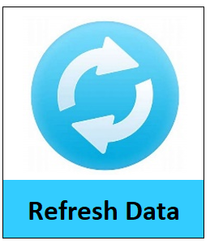
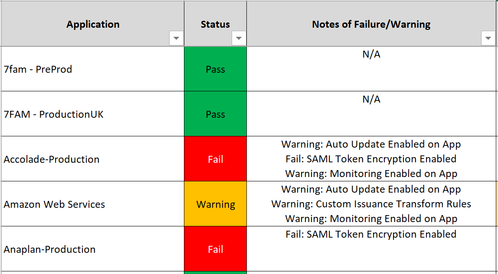
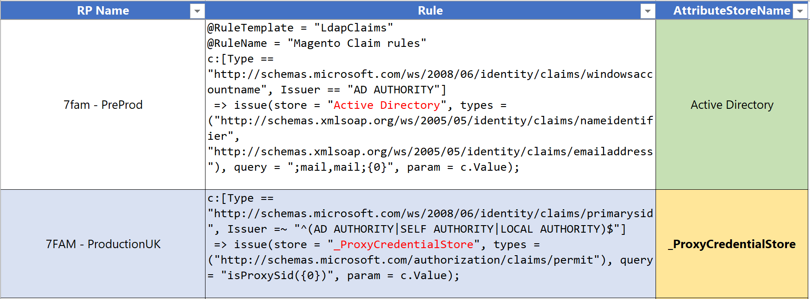
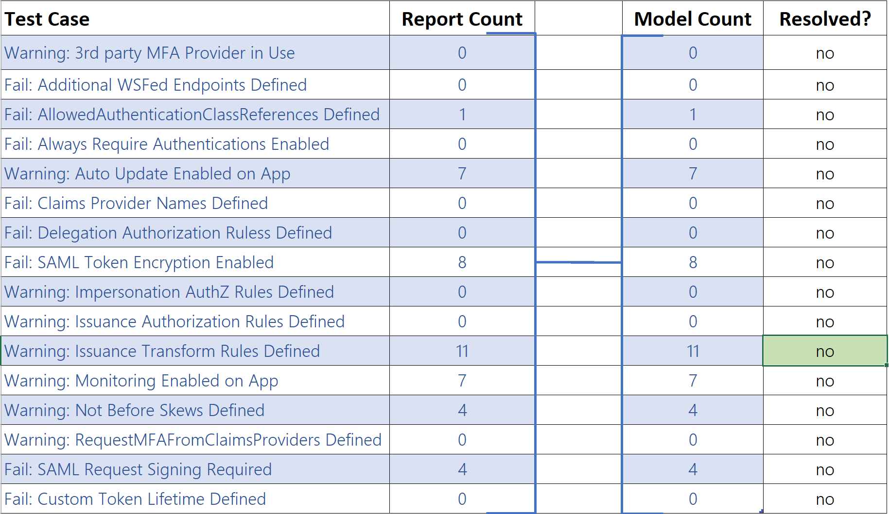

**ADFS to Azure AD App Migration Tool Instructions**

Take our survey to shape the future; we’d love your feedback!
=============================================================

**If you want to shape the future of apps in Azure AD directly, take our
survey!**

<http://aka.ms/apps-survey>

We’re always listening, and if you want to get in touch with us
directly, send an email to <aadappfeedback@microsoft.com>.

Instructions for how to use the tool
====================================

**If you want this same guidance below  in Word Document form click to the [ADFS to AAD Migration Tool Help File](https://github.com/Identity-Deployment-Guides/Identity-Deployment-Guides/blob/master/ADFS%20to%20AzureAD%20App%20Migration/ADFS%20to%20AAD%20Migration%20Tool%20Help%20File.docx) in the repo above and click the "download" button.**

The ADFS to AAD App Migration tool consists of three steps:

### **Collect**
First, we collect the relying party applications from your ADFS server.
This is done via a PowerShell module that will need to run on one of
your ADFS server and it writes the configuration of each application to
the file system as individual .XML files

### **Analyze**
Next, our PowerShell module will enumerate through the individual .XML
files and check the configuration of various settings. This analysis can
be done directly on your ADFS server or can be done on another ADFS
server but currently, it requires ADFS be installed to properly process
the configuration.

### **Report**
Lastly, we generate a final Excel report of your relying party
applications that outlines which applications can be migrated to Azure
AD and which ones can’t and why they can’t. This part has to be run from
a workstation or server where Excel is installed.

## **Collect & Analyze**

### **Instructions if you want to collect and analyze directly from your ADFS server:**

    1. Download PowerShell module from [http://aka.ms/migrateapps/adfsscript](http://aka.ms/migrateapps/adfsscript)
    2. Copy PowerShell module to one of your ADFS servers that you want to run analysis. If you need to save file, be sure to save as .psm1
    3. From this same ADFS server, open PowerShell as "Administrator"
    4. Change the directory to where you placed this PowerShell module
    5. From that PowerShell window, run the following:
       `ipmo .\\ADFSAADMigrationUtils.psm1`
       `Export-ADFS2AADOnPremConfiguration`
        `Test-ADFS2AADOnPremRPTrustSet -RPXMLFileDirectory "C:\adfs\apps"`
    6. Collect the following files from the ADFS server. They will be in the same folder that you changed directories to in Step 4.
        - ADFSRPConfiguration.csv
        - Attributes.csv
        - AttributeStores.csv
        - ClaimTypes.csv
        - RuleDetails.csv
    7. On a workstation that has Excel installed, create a folder at c:\adfs and place the above .csv files in this folder
    8. From this same workstation, open this Excel spreadsheet and navigate to the Dashboard tab and hit the Refresh Data button on the right.

**Note:** If you want to re-export and re-analyze the data, just repeat Steps 5-7 and overwrite files in Step 6 with new files

### **Instructions If You Want to run the Analysis from Another Server**

#### **ADFS Server**

    1.  On your ADFS server, download PowerShell module from [http://aka.ms/migrateapps/adfsscript](http://aka.ms/migrateapps/adfsscript). If you need to save file, be sure to save as .psm1.
    2.  From this same ADFS server, open PowerShell as "Administrator".
    4. Change the directory to where you placed this PowerShell module.
    5. From that PowerShell window, run the following:
       `ipmo .\\ADFSAADMigrationUtils.psm1`
       `Export-ADFS2AADOnPremConfiguration`

#### **Run Analysis From Another Server **

    1. Copy c:\ADFS\ADFSApps.zip from your ADFS server to another ADFSserver where you want to run analysis
    2. On this other ADFS server, unzip the .XML files to a folder of your choosing
    3. On this other ADFS server, download PowerShell module from [http://aka.ms/migrateapps/adfsscript](http://aka.ms/migrateapps/adfsscript). If you need to save file, be sure to save as .psm1 .
    4. From this other server, open PowerShell as "Administrator".
    5. Change the directory to where you placed this PowerShell module.
    6. From that PowerShell window, run the following:
        `ipmo .\\ADFSAADMigrationUtils.psm1`
        `Test-ADFS2AADOnPremRPTrustSet -RPXMLFileDirectory "<Full Path to XML Folder>"`
    7. Collect the following files from this ADFS server. They will be in the same folder that you changed directories to in Step 5.
        - ADFSRPConfiguration.csv
        - Attributes.csv
        - AttributeStores.csv
        - ClaimTypes.csv
        - RuleDetails.csv
    8. On a workstation that has Excel installed, create a folder at c:\adfs and place the above .csv files in this folder
    9. From this same workstation, open this Excel spreadsheet and navigate to the Dashboard tab and hit the Refresh Data button on the right.

**Note:** If you want to re-export and re-analyze the data, just repeat Steps 7-10 and overwrite files in Step 6 with new files.

## **Report - Instructions for Using the Excel Spreadsheet**

### **Refreshing Your Data**

Anytime you want to refresh your data, just make sure that the latest .csv files are located within c:\\ADFS and from the Dashboard tab, just hit the ‘Refresh Data’ button:

### **Viewing Your All-Up Results**

The first tab you’ll want to review is the ‘Dashboard’ tab to see an all-up view of how many applications you have and whether they can migrate to Azure AD or not:

### **Viewing Individual Application Results**

Next, you’ll want to look at the individual status on each application on the ‘AAD App Migration Report’ tab. This will tell you whether the application will readily migrate to Azure AD or whether there are settingd on the application that are currently incompatible with Azure AD or need to be reviewed further.

As you can see here, both 7FAM applications passed and can be readily migrate to Azure AD but the remaining three applications have some items on them that could prevent them from being moved to Azure AD.

**Note**: See bottom of document for description of each result

Additionally, from this same tab, we include the following items per application so you can gain some further insight about what configuration changes may be required to move your application to Azure AD:

-   **Claim Rules to Review:** We flag any “custom” claim rules that may
    not be compatible with Azure AD and provide the total number of
    rules per application, so you can prioritize accordingly.

-   **Attributes Not Synced to AAD by Default:** If any of the claim
    rules contains AD attributes that aren’t synced to Azure AD by
    default, we include this total count here.

-   **Authorization Rules Present:** If your application has any
    authorization rules present, all this means is you’ll need to move
    these over to Azure AD Conditional Access.

-   **Restricted Claim Types:** Azure AD doesn’t allow certain claim
    type URI’s to be modified so we include whether any of the claim
    rules contains any of these restricted claim type URI’s. This is
    more informational than anything.

-   **Custom Attribute Stores:** Azure AD doesn’t currently support any
    custom attribute stores so if you’re using anything beyond ‘Active
    Directory’ within your claim rules, we give you that count here.

### **Viewing All your Claim Rules**

If you want more detail on all your claim rules across all your applications, navigate to the ‘Claim Rules Details’ tab. This provides you with the following information:

-   **RP Name:** The name of the application

-   **Ruleset:** Whether claim rule is for issuance, authorization,
    delegation, or impersonation

-   **Rule:** The entirety of the individual claim rule

-   **IsRuleKnownMigrateablePattern:** Whether the rule can be readily
    migrated to Azure AD or not. Many rules may migrate with minor
    modifications.

-   **KnownRulePatternName:** We run each rule through a series of
    checks to see whether it’s compatible with Azure AD. This is just
    the name of the rule that the claim rule matched. Only present if
    the rule passed.

### **Viewing All your AD Attributes within your Claim Rules**

If you want more detail on all the AD attributes in use across all your applications, navigate to the ‘AD Attributes’ tab. This provides you with the following information:

-   **RP Name:** The name of the application

-   **Ruleset:** Whether claim rule is for issuance, authorization,
    delegation, or impersonation

-   **Rule:** The entirety of the individual claim rule

-   **ADAttribute:** Actual AD attribute in use within the rule

-   **Synced to Azure AD by Default:** By default, Azure AD Connect only
    syncs a finite list of attributes although it can be customized to
    sync more. You’ll want to ensure that any application you migrate to
    Azure AD has all the necessary AD attributes also being synced to
    Azure AD via Azure AD Connect.

-   **Note:** We highlight (in red) where the AD attribute is in use
    within the claim rule.

### **Viewing All your Claim Type URI’s within your Claim Rules**

If you want more detail on all the individual claim types URI’s in use across all your applications, navigate to the ‘Claim Types’ tab. When moving an application to Azure AD, it easier to just register your individual claim types within Azure AD rather than asking your software vendor to change their configuration. This provides you with the following information:

-   **RP Name:** The name of the application

-   **Rule:** The entirety of the individual claim rule

-   **Claim Type:** The claim type URI in use within that claim rule

-   **Restricted Claim Type:** Azure AD doesn’t allow certain claim type
    URI’s to be modified so we include whether this specific claim type
    is restricted within Azure AD. This is more informational than
    anything.

-   **Note:** We highlight (in red) where the Claim Type URI is in use
    within the claim rule.

### **Viewing All your Attribute Stores within your Claim Rules**

If you want more detail on all the Attribute Stores in use across all your applications, navigate to the ‘Attribute Stores’ tab. Azure AD doesn’t currently support any custom attribute stores. This provides you with the following information:

-   **RP Name:** The name of the application

-   **Rule:** The entirety of the individual claim rule

-   **AttributeStoreName:** The name of the Attribute Store in use. We
    highlight any that aren’t ‘Active Directory’

-   **Note:** We highlight (in red) where the Attribute Store is in use
    within the claim rule. Also, the \_ProxyCredentialStore is an ADFS
    2.0 concept that isn’t truly a blocker for moving an application to
    Azure AD.

### **Modeling Change to your applications**

We wanted to provide a way for customers to see the migration impact of changes they are willing to make to their applications without them actually having to make any changes. So back on the ‘Dashboard’ tab, you can type **Yes** next to the issues you’re willing to resolve and see how that impacts your migration %. Additionally, the issues impacting the most applications will highlight themselves in a light green like so:

Next, mark the items you are committing to resolve or features that may be coming as part of the Azure AD roadmap:

Upon doing so, the top of the ‘Dashboard’ tab will update to reflect your new migration % like so:

## **Viewing All Tests we Ran Your Applications Through**

If you’re interested to see all the tests we ran your applications through with a status of Pass, Warning, or Fail, navigate to the ‘All Apps Details’ tab. Here is more information on each of the columns:

| Property                                        	| Status            	| Description                                                                                                                                                         	|
|-------------------------------------------------	|-------------------	|---------------------------------------------------------------------------------------------------------------------------------------------------------------------	|
| RP Name                                         	| N/A               	| Friendly name of application                                                                                                                                        	|
| Result                                          	| Pass/Warning/Fail 	| All-up result for specific application. If application has any fails, result will default to fail. If application only has warning, result will default to warning. 	|
| Test-ADFSRPAdditionalAuthenticationRules        	| Pass/Warning      	| Testing for any on-premises MFA providers. Will need to be moved to Azure MFA or Custom Controls integration with 3rd party MFA provider.                           	|
| Test-ADFSRPAdditionalWSFedEndpoint              	| Pass/Fail         	| Testing for multiple WS-Fed assertion endpoints since Azure AD only supports (1) one of these today.                                                                	|
| Test-ADFSRPAllowedAuthenticationClassReferences 	| Pass/Fail         	| Whether the application is configured to only allow certain authentication types                                                                                    	|
| Test-ADFSRPAlwaysRequireAuthentication          	| Pass/Fail         	| Whether the application is configured to ignore SSO cookies and ‘Always Prompt for Authentication’. Not supported by Azure AD today.                                	|
| Test-ADFSRPAutoUpdateEnabled                    	| Pass/Warning      	| Whether ADFS is configured to auto update the application based on changes within the federation metadata                                                           	|
| Test-ADFSRPClaimsProviderName                   	| Pass/Fail         	| Whether the application is hardcoded to another claim provider. Not supported by Azure AD today.                                                                    	|
| Test-ADFSRPDelegationAuthorizationRules         	| Pass/Fail         	| Whether the application has any custom delegation authorization rules defined. Azure AD does not support this today.                                                	|
| Test-ADFSRPEncryptClaims                        	| Pass/Fail         	| Whether the application is configured for SAML Token Encryption. Azure AD does not support this today.                                                              	|
| Test-ADFSRPImpersonationAuthorizationRules      	| Pass/Warning      	| Whether the application has any custom impersonation authorization rules defined. Azure AD does not support this today.                                             	|
| Test-ADFSRPIssuanceAuthorizationRules           	| Pass/Warning      	| Whether the application has any custom issuance authorization rules defined. Move to AAD CA                                                                         	|
| Test-ADFSRPIssuanceTransformRules               	| Pass/Warning      	| Whether the application has any custom issuance transform rules defined                                                                                             	|
| Test-ADFSRPMonitoringEnabled                    	| Pass/Warning      	| Whether ADFS is configured to monitor a federation metadata for this application.                                                                                   	|
| Test-ADFSRPNotBeforeSkew                        	| Pass/Warning      	| Whether ADFS allows a time skew based on the NotBefore and NotOnOrAfter times within SAML token.                                                                    	|
| Test-ADFSRPRequestMFAFromClaimsProviders        	| Pass/Warning      	| Whether the application is hardcoded to another claim provider and requires MFA. Not supported by Azure AD today.                                                   	|
| Test-ADFSRPSignedSamlRequestsRequired           	| Pass/Fail         	| Whether the application is configured for SAML Request Signing. Azure AD does not support this today.                                                               	|
| Test-ADFSRPTokenLifetime                        	| Pass/Fail         	| Whether the application is configured for a custom token lifetime. ADFS default is 1 hour.                                                                          	|

Getting support from Microsoft
==============================

There are several different avenues from which you can get support during your AD FS – Azure AD migration:

**Azure Support:** Depending on your Enterprise Agreement with Microsoft, you can call Microsoft Support and open a ticket for any
issue related to your Azure Identity deployment. For more information on how to get in touch with Microsoft Support, please visit our Azure support portal: <https://azure.microsoft.com/support>

**FastTrack**: If you have purchased Enterprise Mobility and Security (EMS) licenses or Azure AD Premium licenses, you may be eligible to receive deployment assistance from the FastTrack program. For more information on how to engage with FastTrack, please refer to our documentation on the [FastTrack Center Eligibility Benefit for
Enterprise Mobility and
Security](https://docs.microsoft.com/en-us/enterprise-mobility-security/solutions/enterprise-mobility-fasttrack-program)

**Engage the Product Engineering Team:** If you are working on a major customer deployment with millions of users, you can work with your Microsoft account team or your Cloud Solutions Architect to decide if the project’s deployment complexity warrants working directly with the Azure Identity Product Engineering team.

**EMS Blog:** Subscribe to the [EMS
Blog](https://cloudblogs.microsoft.com/enterprisemobility/?product=azure-active-directory) to stay up to date with all the latest product announcements, deep dives, and roadmap information provided directly by the Identity engineering team. Further, you can also post comments and get feedback from the engineering group.

**Azure Active Directory Public Forums:** Azure AD also has several closely monitored channels available to the public. Here are some useful links:

-   StackOverflow using the tags
    [‘adfs’](https://stackoverflow.com/questions/tagged/adfs)

-   [UserVoice](https://feedback.azure.com/forums/169401-azure-active-directory)
    to submit or vote on new feature requests in Azure AD

-   Microsoft Azure on Reddit: https://www.reddit.com/r/AZURE/

-   [MSDN Forum for Azure
    AD](https://social.msdn.microsoft.com/Forums/en-US/home?forum=WindowsAzureAD)
